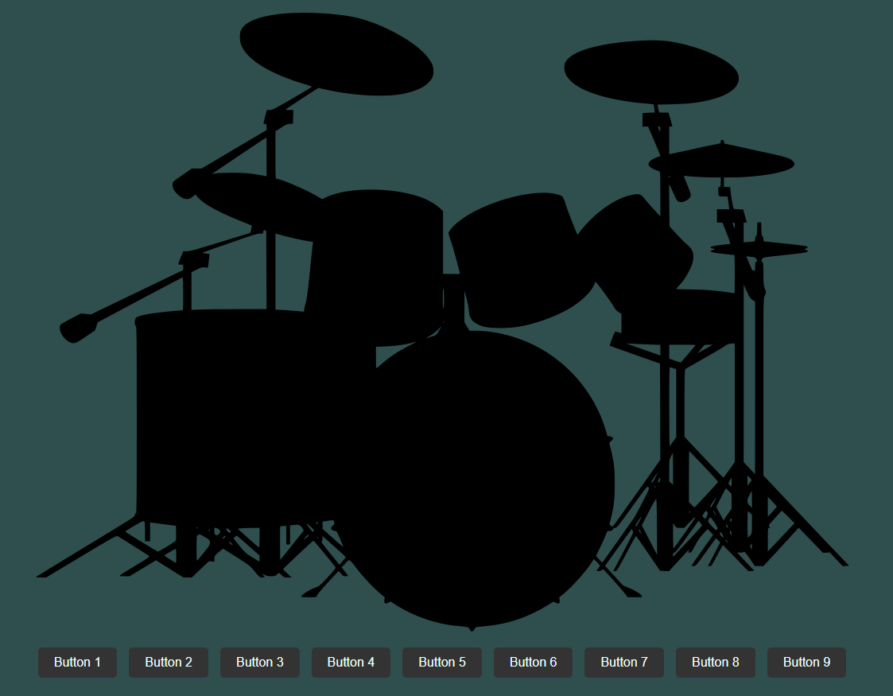

# Javascript Drum Kit - Homework 2

### Canlı Site

A drum kit page where the drum sounds can be listened by either pressing from A to L keys or by just clicking to buttons.
[Javascript Drum Kit](https://noyansoylu.github.io/Patika-Front-End-Bootcamp-Practices/Week5/hw2/index.html)
