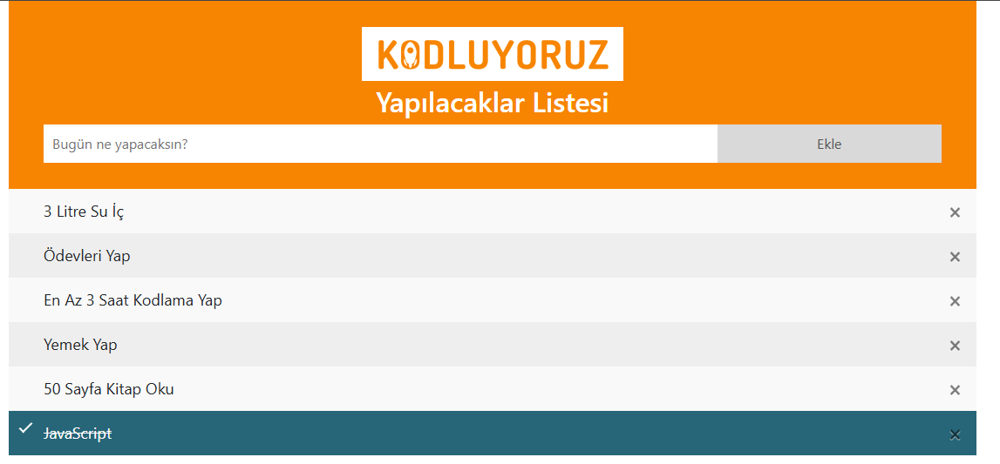

# HW1 - JavaScript ile To Do List

In this homework, I created a javascript for adding and removing list items to an already existing list located in index.html.
[Showcase](https://noyansoylu.github.io/Patika-Front-End-Bootcamp-Practices/Week6/hw1/index.html)
